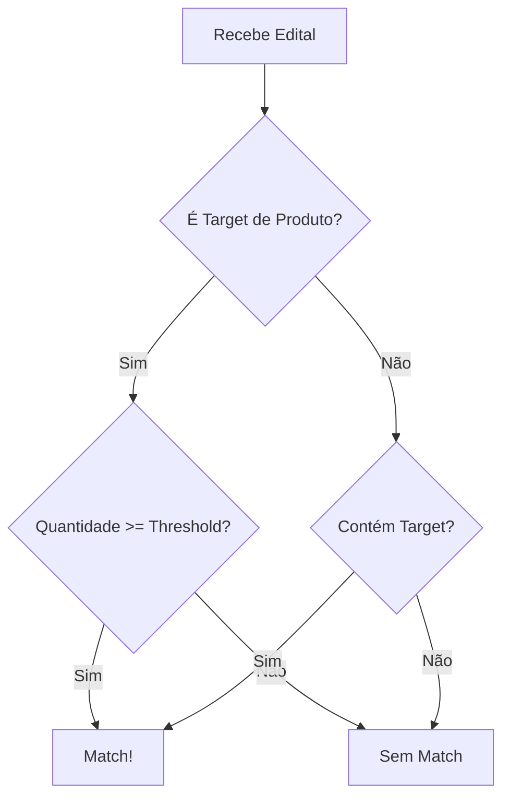

# Edital Summarizer - Guia do Usuário Comercial

## O que é?

O Edital Summarizer é uma ferramenta que analisa editais de licitação e identifica oportunidades de negócio relevantes para sua área. Ele funciona como um "filtro inteligente" que separa os editais que interessam para sua área de negócio.

## Como Funciona?

### 1. Entradas do Sistema
Você precisa fornecer apenas duas informações:
- **Target**: O que você quer vender/fornecer
- **Threshold**: Quantidade mínima de interesse (se aplicável)

### 2. Tipos de Targets

#### 2.1 Targets de Produtos (Dispositivos)
São targets que envolvem a venda/fornecimento de equipamentos físicos. Exemplos:
- Notebooks
- Tablets
- Smartphones
- Equipamentos de TI
- Dispositivos IoT

Para estes targets, você DEVE informar um threshold (quantidade mínima).

#### 2.2 Targets de Serviços
São targets que envolvem a prestação de serviços ou soluções. Exemplos:
- RPA (Automação de Processos)
- Inteligência Artificial
- Consultoria em TI
- Desenvolvimento de Software
- Cloud Computing

Para estes targets, use threshold = 0 (o sistema ignorará a verificação de quantidade).

### 3. Fluxo de Decisão



### 4. Exemplos Práticos

#### Exemplo 1: Venda de Notebooks
```bash
python -m src.edital_summarizer.main \
  samples/edital-001 \
  --target "Fornecimento de Notebooks para Uso Administrativo" \
  --threshold 500 \
  -o resultado.json \
  -v
```
- O sistema vai procurar editais que mencionem notebooks
- Só vai considerar relevante se a quantidade for >= 500
- Ignora editais com menos notebooks

#### Exemplo 2: Serviço de RPA
```bash
python -m src.edital_summarizer.main \
  samples/edital-001 \
  --target "Automação de Processos com RPA" \
  --threshold 0 \
  -o resultado.json \
  -v
```
- O sistema vai procurar editais que mencionem RPA/automação
- Não verifica quantidade (threshold = 0)
- Considera relevante se mencionar RPA/automação

#### Exemplo 3: Forçar Match
```bash
python -m src.edital_summarizer.main \
  samples/edital-001 \
  --target "Fornecimento de Tablets para Educação" \
  --threshold 1000 \
  --force-match \
  -o resultado.json \
  -v
```
- Força o target_match a ser True
- Útil para testes ou quando você quer ignorar o threshold

### 5. Resultados

O sistema retorna um JSON com:
```json
{
    "bid_number": "string",           // Número do edital/licitação
    "city": "string",                 // Cidade/UF do edital
    "target_match": true/false,       // O edital é relevante para seu target?
    "threshold_match": "true/false/inconclusive",  // Atingiu a quantidade mínima?
    "is_relevant": true/false,        // O edital é relevante considerando todas as regras?
    "summary": "...",                 // Resumo detalhado do conteúdo do edital
    "justification": "..."            // Justificativa clara e coerente da decisão
}
```

#### 5.1 Lógica de Relevância (is_relevant)

O campo `is_relevant` é determinado pelas seguintes regras:

1. Se `target_match` for `false`:
   - `is_relevant` será `false`
   - A justificativa deve explicar por que o edital não é relevante para o target

2. Se `target_match` for `true`:
   - Se `threshold_match` for `"inconclusive"` ou `"false"`:
     - `is_relevant` será `false`
     - A justificativa deve explicar por que o threshold não foi atingido
   - Se `threshold` for `0` (sem verificação de quantidade):
     - `is_relevant` será `true`
     - A justificativa deve explicar por que o edital é relevante
   - Se `threshold_match` for `"true"`:
     - `is_relevant` será `true`
     - A justificativa deve explicar por que o edital é relevante

#### 5.2 Resumo e Justificativa

- **Summary**: Deve conter um resumo detalhado do conteúdo do edital, incluindo:
  - Cidade/UF
  - Objeto da licitação
  - Quantidades mencionadas
  - Especificações técnicas relevantes
  - Prazos e valores
  - Outras informações importantes

- **Justification**: Deve explicar claramente:
  - Por que o edital é ou não relevante
  - Se relevante: destacar os pontos que o tornam relevante
  - Se não relevante: explicar por que não atende aos critérios
  - Em caso de threshold: explicar a análise da quantidade

### 6. Dicas para Targets Efetivos

1. **Seja Específico**
   - ❌ "Notebooks"
   - ✅ "Fornecimento de Notebooks para Uso Administrativo"

2. **Inclua Contexto**
   - ❌ "RPA"
   - ✅ "Automação de Processos com RPA para Área Financeira"

3. **Use Termos do Mercado**
   - ❌ "IA"
   - ✅ "Solução de Inteligência Artificial para Análise de Dados"

4. **Threshold Realista**
   - Para notebooks: 500-1000
   - Para tablets: 1000-2000
   - Para smartphones: 500-1000

### 7. Casos de Uso Comuns

#### 7.1 Venda de Equipamentos
```bash
# Notebooks para Administração
python -m src.edital_summarizer.main \
  samples/edital-001 \
  --target "Fornecimento de Notebooks para Uso Administrativo" \
  --threshold 500 \
  -o resultado.json \
  -v

# Tablets para Educação
python -m src.edital_summarizer.main \
  samples/edital-001 \
  --target "Fornecimento de Tablets para Educação" \
  --threshold 1000 \
  -o resultado.json \
  -v

# Smartphones Corporativos
python -m src.edital_summarizer.main \
  samples/edital-001 \
  --target "Fornecimento de Smartphones Corporativos" \
  --threshold 500 \
  -o resultado.json \
  -v
```

#### 7.2 Serviços de TI
```bash
# RPA para Financeiro
python -m src.edital_summarizer.main \
  samples/edital-001 \
  --target "Automação de Processos com RPA para Área Financeira" \
  --threshold 0 \
  -o resultado.json \
  -v

# IA para Saúde
python -m src.edital_summarizer.main \
  samples/edital-001 \
  --target "Solução de Inteligência Artificial para Análise de Imagens Médicas" \
  --threshold 0 \
  -o resultado.json \
  -v

# Cloud Computing
python -m src.edital_summarizer.main \
  samples/edital-001 \
  --target "Migração para Cloud Computing" \
  --threshold 0 \
  -o resultado.json \
  -v
```

### 8. Boas Práticas

1. **Organização de Editais**
   - O sistema processa automaticamente qualquer tipo de arquivo:
     - PDFs, Word, PowerPoint, Excel
     - Arquivos de texto (TXT, MD)
     - JSON (incluindo metadata.json)
     - Arquivos ZIP (com múltiplos documentos)
     - Pastas com múltiplos arquivos
   - Não é necessário organizar os arquivos - o sistema faz isso automaticamente
   - O metadata.json é processado por padrão para informações adicionais

2. **Análise de Resultados**
   - Verifique o resumo gerado
   - Analise as justificativas
   - Ajuste os targets conforme necessário

3. **Threshold**
   - Comece com valores conservadores
   - Ajuste baseado nos resultados
   - Considere o tamanho do mercado

4. **Modo Verboso**
   - Use a flag `-v` para ver logs detalhados
   - Útil para debug e entendimento do processamento
   - Mostra informações sobre cada etapa do processamento

### 9. Suporte

Se precisar de ajuda:
1. Verifique se o target está bem definido
2. Confirme se o threshold está adequado
3. Analise o resumo e a justificativa
4. Ajuste os parâmetros conforme necessário
5. Use o modo verboso (`-v`) para mais detalhes 