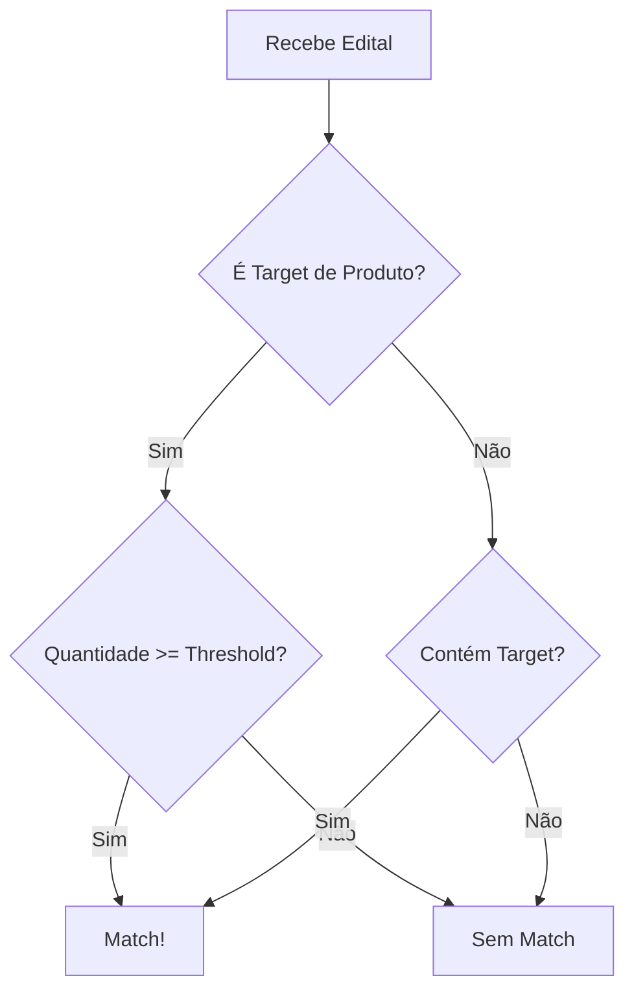

# Edital Summarizer - Guia do Usuário Comercial

## O que é?

O Edital Summarizer é uma ferramenta que analisa editais de licitação e identifica oportunidades de negócio relevantes para sua área. Ele funciona como um "filtro inteligente" que separa os editais que interessam para sua área de negócio.

## Como Funciona?

### 1. Entradas do Sistema
Você precisa fornecer apenas duas informações:
- **Target**: O que você quer vender/fornecer
- **Threshold**: Quantidade mínima de interesse (se aplicável)

### 2. Tipos de Targets

#### 2.1 Targets de Produtos (Dispositivos)
São targets que envolvem a venda/fornecimento de equipamentos físicos. Exemplos:
- Notebooks
- Tablets
- Smartphones
- Equipamentos de TI
- Dispositivos IoT

Para estes targets, você DEVE informar um threshold (quantidade mínima).

#### 2.2 Targets de Serviços
São targets que envolvem a prestação de serviços ou soluções. Exemplos:
- RPA (Automação de Processos)
- Inteligência Artificial
- Consultoria em TI
- Desenvolvimento de Software
- Cloud Computing

Para estes targets, use threshold = 0 (o sistema ignorará a verificação de quantidade).

### 3. Fluxo de Decisão



### 4. Exemplos Práticos

#### Exemplo 1: Venda de Notebooks
```bash
Target: "Fornecimento de Notebooks para Uso Administrativo"
Threshold: 500
```
- O sistema vai procurar editais que mencionem notebooks
- Só vai considerar relevante se a quantidade for >= 500
- Ignora editais com menos notebooks

#### Exemplo 2: Serviço de RPA
```bash
Target: "Automação de Processos com RPA"
Threshold: 0
```
- O sistema vai procurar editais que mencionem RPA/automação
- Não verifica quantidade (threshold = 0)
- Considera relevante se mencionar RPA/automação

#### Exemplo 3: Tablets para Educação
```bash
Target: "Fornecimento de Tablets para Educação"
Threshold: 1000
```
- O sistema vai procurar editais sobre tablets para educação
- Só considera relevante se a quantidade for >= 1000
- Ignora editais com menos tablets

### 5. Resultados

O sistema retorna um JSON com:
```json
{
    "target_match": true/false,        // O edital é relevante para seu target?
    "threshold_match": "true/false/inconclusive",  // Atingiu a quantidade mínima?
    "summary": "...",                  // Resumo do edital
    "justification": "..."             // Por que não é relevante (se aplicável)
}
```

### 6. Dicas para Targets Efetivos

1. **Seja Específico**
   - ❌ "Notebooks"
   - ✅ "Fornecimento de Notebooks para Uso Administrativo"

2. **Inclua Contexto**
   - ❌ "RPA"
   - ✅ "Automação de Processos com RPA para Área Financeira"

3. **Use Termos do Mercado**
   - ❌ "IA"
   - ✅ "Solução de Inteligência Artificial para Análise de Dados"

4. **Threshold Realista**
   - Para notebooks: 500-1000
   - Para tablets: 1000-2000
   - Para smartphones: 500-1000

### 7. Casos de Uso Comuns

#### 7.1 Venda de Equipamentos
```bash
# Notebooks para Administração
Target: "Fornecimento de Notebooks para Uso Administrativo"
Threshold: 500

# Tablets para Educação
Target: "Fornecimento de Tablets para Educação"
Threshold: 1000

# Smartphones Corporativos
Target: "Fornecimento de Smartphones Corporativos"
Threshold: 500
```

#### 7.2 Serviços de TI
```bash
# RPA para Financeiro
Target: "Automação de Processos com RPA para Área Financeira"
Threshold: 0

# IA para Saúde
Target: "Solução de Inteligência Artificial para Análise de Imagens Médicas"
Threshold: 0

# Cloud Computing
Target: "Migração para Cloud Computing"
Threshold: 0
```

### 8. Boas Práticas

1. **Organização de Editais**
   - O sistema processa automaticamente qualquer tipo de arquivo:
     - PDFs, Word, PowerPoint, Excel
     - Arquivos de texto (TXT, MD)
     - JSON (incluindo metadata.json)
     - Arquivos ZIP (com múltiplos documentos)
     - Pastas com múltiplos arquivos
   - Não é necessário organizar os arquivos - o sistema faz isso automaticamente
   - O metadata.json é processado por padrão para informações adicionais

2. **Análise de Resultados**
   - Verifique o resumo gerado
   - Analise as justificativas
   - Ajuste os targets conforme necessário

3. **Threshold**
   - Comece com valores conservadores
   - Ajuste baseado nos resultados
   - Considere o tamanho do mercado

### 9. Suporte

Se precisar de ajuda:
1. Verifique se o target está bem definido
2. Confirme se o threshold está adequado
3. Analise o resumo e a justificativa
4. Ajuste os parâmetros conforme necessário 